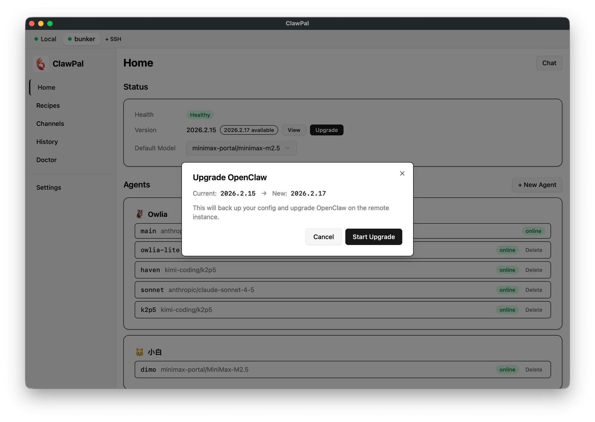
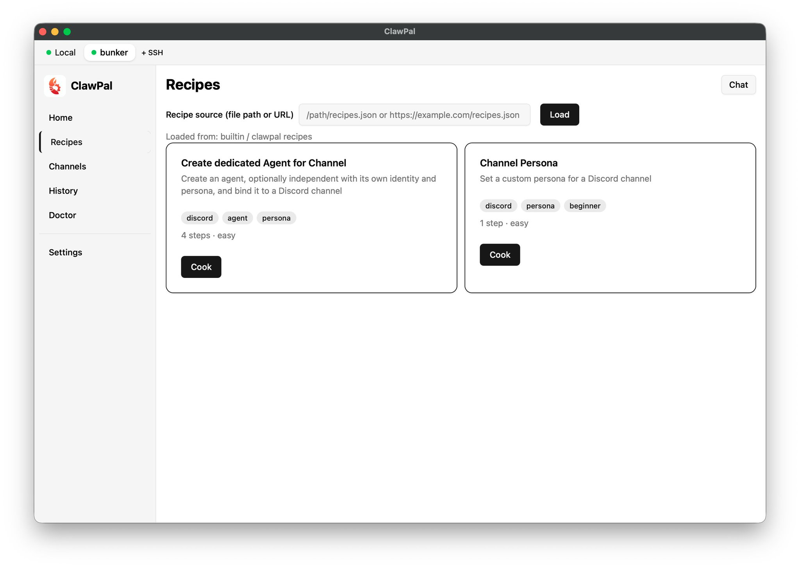
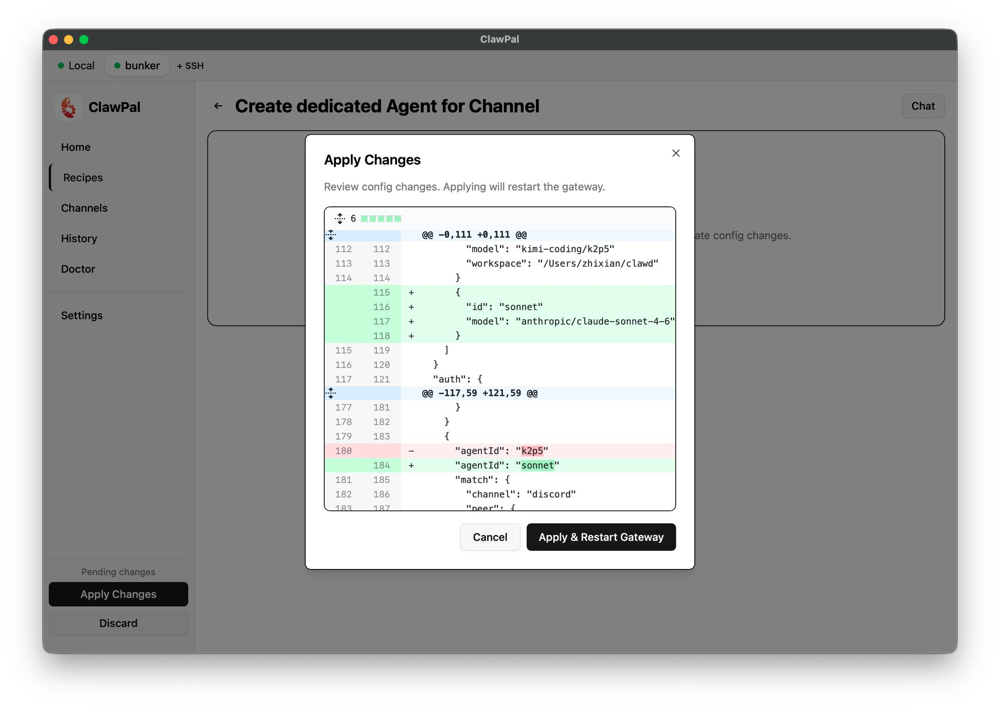
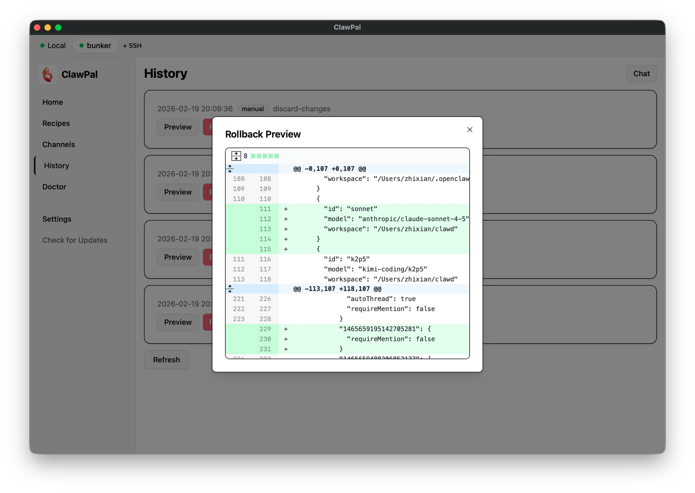
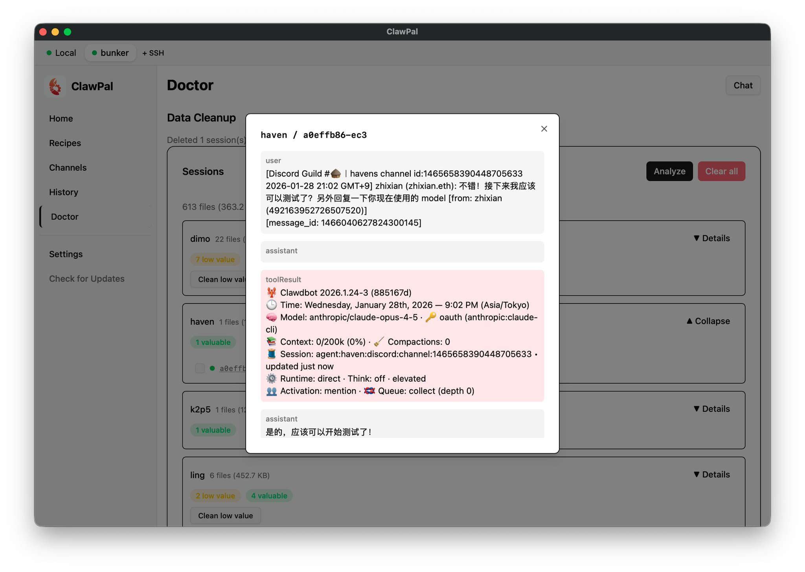

> Ever asked your AI agent to modify its own config, only to watch it break itself? Then you spent an hour fixing it? Ever wanted a multi-agent Discord setup but couldn't get the config right no matter how many tutorials you read?

Happy Lunar New Year! I spent the holiday coding in Yokohama—Spring Festival Vibe Coding, if you will—and the productivity was surprisingly good! So what did I build? Let me introduce: **ClawPal**.

ClawPal is a desktop management tool for OpenClaw. It gives you a visual interface to manage agents, channels, models, sessions, and all sorts of configurations—no more hand-editing JSON files.

Beyond managing your local instance, ClawPal also supports SSH connections to remote OpenClaw deployments, with the same full functionality.

I've also built a **Recipes** feature—think of it as shareable best practices. You can follow guided steps to set up interesting configurations, like assigning different personas (system prompts) to different Discord channels.

ClawPal is free and open source, available for macOS, Windows, and Linux.

👉 Download: [clawpal.zhixian.io](https://clawpal.zhixian.io)

Power users can grab it and start exploring. Below is a walkthrough for everyone else.

## Why I Built ClawPal

My previous articles on [multi-agent collaboration](https://x.com/zhixianio/status/2021384359245381982) and [Discord best practices](https://x.com/zhixianio/status/2018595121084994002) got great responses, and I made many friends through them. But when I actually talked to people, I realized that even with the right ideas, executing the config was still painful. Lately, OpenClaw seems to have gotten worse at modifying its own config—maybe because the system has grown more complex. It often breaks things or edits the wrong place, hallucinating hard.

So I thought: is there a way to make daily operations easier, reduce config uncertainty, AND let me share best practices? Something lighter than Skills, like recipes—whether you want your 🦞 braised or steamed, you can just use it directly.

After thinking it through, I decided to just build a tool. And ClawPal was born.

## Connect to Your OpenClaw (SSH Supported)

At the top of ClawPal is the connection bar. There's a default `Local` option—if you have OpenClaw installed locally, it shows up automatically. On the right, there's a "+SSH" button to add remote machines. If that machine is also running OpenClaw, you can manage it just like a local instance.

This is especially useful for those running OpenClaw on a separate server. No matter what computer you're on, you can still manage your remote setup seamlessly.

## Status: One-Click Backup, Upgrade, and Model Switching

This page shows basic info about your OpenClaw instance—health status, version number, and update notifications. ClawPal provides one-click backup-then-upgrade, so you never lose data to unexpected issues. This is what I have my agent do every time: backup before update, no exceptions.

All backups appear in the Backups section at the bottom. You can view contents, one-click Restore, or Delete what you don't need. If a fresh backup doesn't show up, just right-click and Reload the page.

## Chat: Ask Questions Anytime

Every page has a Chat button in the top-right corner, directly connected to your OpenClaw. Click it and choose which agent to talk to (if you have multiple). This is a dedicated session that won't mix with your other sessions. I've added some preset prompts so the agent roughly knows what ClawPal can do—handy for quick questions.

## Agent Management

You can see my agent list here. Top-level agents are those with independent personas (workspaces)—they have emoji and names on their cards. If you've created sub-agents under them (no independent workspace, but different models or configs), they show up as a second level below.

For example, I have `Owlia-lite` for simple tasks, plus some specialized or test agents—all clearly visible. You can also easily switch models for different agents right here. Pretty convenient!

## Recipes: Best Practices, Step by Step

This is one of ClawPal's highlight features and a main reason I built this tool. Currently there are two built-in recipes, with more to come:

**Create dedicated Agent for Channel**: Create a dedicated agent for a specific channel. Give it a name, pick a model (use a lighter model for lightweight tasks), then select the Guild and Channel. I've parsed out channel names so you don't have to hunt through numeric IDs.

If you want more than a basic agent—say, one with its own workspace—check the box below and you'll get options for nickname, emoji, and personality traits.

After completing the steps, Pending Changes appears in the bottom-left. Click Apply to see a diff of what will change in your config file. If it looks good, hit Apply and Restart. If not, Cancel and Discard.

**Channel Persona**: A friend in the comments pointed this out: OpenClaw lets you set system-prompt-like text for each channel. Even without a dedicated agent, entering that channel injects a prompt telling the agent which tools to use or what persona to adopt. This is a lightweight approach to channel-specific behavior, compared to the heavier "create a new agent" approach above.

At the top of the Recipes page, there's also an option to load from external sources—this is a reserved interface. Once I refine the Recipe system, I'll open it up for everyone to write and share their own recipes. I'll also add a section on the website for one-click recipe loading. Note that Recipes have no executable code—they're just config patches, much lighter and safer than Skills.

## Channels: Unified Chat Configuration

This is probably the most-used feature. Quickly assign an agent to each channel. The agent doesn't have to be a separate persona—it's really just about assigning different models. For different personas, use the Recipe feature for now; direct support isn't here yet.

## History: Config Change Log with One-Click Rollback

Every config operation creates a History entry. If you think something went wrong, you can Rollback—but you'll probably want to Preview first to see what the rollback will change.

One note: clicking Rollback doesn't take effect immediately—you still need to click Apply Changes. So if you accidentally hit Rollback, don't panic. Just Discard in the bottom-left, and the rollback is cancelled. You can even see the "Discard this Rollback" record in History. The workflow in ClawPal is designed to be safe.

## Doctor: Finally, a Good Session Manager!

The Doctor page is relatively simple for now—I haven't built out many diagnostic features yet. I figured a local Doctor doesn't add much value; maybe a remote Doctor service makes more sense, with proper audit and authorization on the frontend. For now, Doctor does one thing: Session cleanup.

Click Analyze, wait a few seconds, and see what sessions each agent has—how many seem low-value, how many seem valuable. Take the value judgment as a rough guide. If you really want to delete, click Details on the right to list all sessions. You can open each one to check its contents. Select the useless or accidentally-created ones and Delete.

I find this very satisfying for my OCD. Discord's autoThread feature creates sessions after just a few messages—it drives me crazy. Now I can clean them up manually in ClawPal!

## Settings: Manage Your Models & API Keys

This does one thing: manage your AI service profiles—Providers (like OpenAI, Anthropic, Google) and their API keys.

While you can't add OAuth directly from the left panel, you can still use OpenClaw's built-in OAuth flow. Once logged in, the profile appears on the right and becomes available for selection elsewhere.

Also, if you've already added an Anthropic API key and just want to switch models (say, from Opus to Sonnet), the API Key field will show "optional - key already available"—no need to re-enter it.

---

That's it for version one—should be enough to get started. Fair warning: this tool was built in under 3 days, so you might hit some bugs. It hasn't had the testing a production product would get, so please bear with me! I have more features planned and will roll them out gradually. Feel free to join the Discord (link on the [homepage](https://clawpal.zhixian.io)) to report bugs or request features. Let's make this better together—no more hand-editing JSON!
